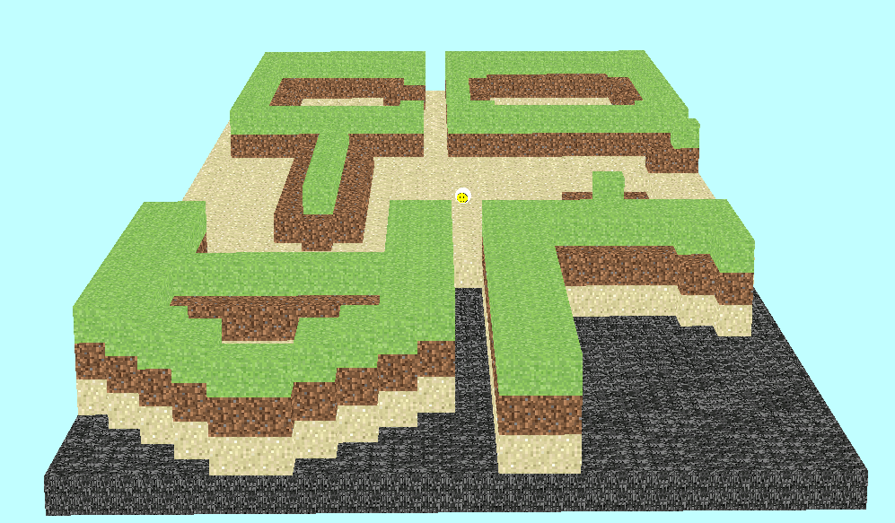
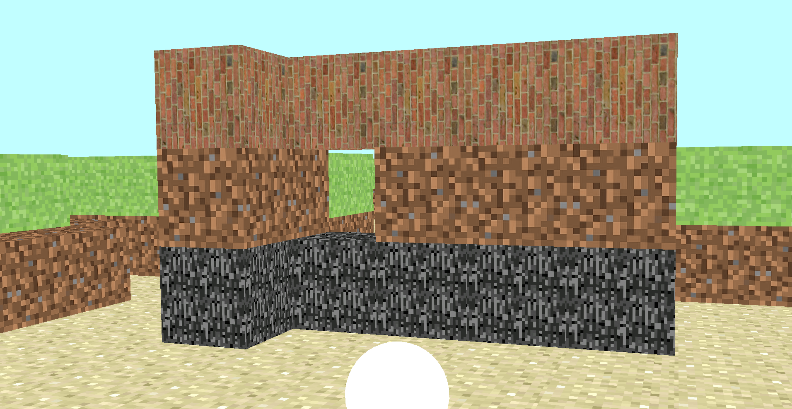
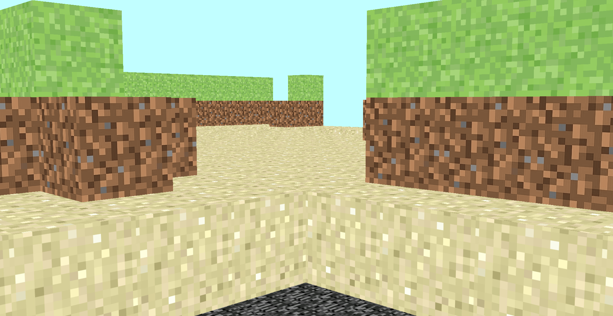

# Minecraft Lite

Minecraft Lite is a lightweight 3D game built using the Panda3D game engine, inspired by the block-based mechanics of Minecraft. It allows players to navigate a 3D world, build and destroy blocks, change block textures, and save/load maps. The game features a simple first-person perspective with mouse and keyboard controls for movement and interaction.

## Features
- **3D World Navigation**: Move the player character using WASD keys and control the camera with mouse movements.
- **Block Building and Destruction**: Place and remove blocks in the game world.
- **Texture Selection**: Choose from various block textures (e.g., bedrock, grass, sand, stone, wood) using number keys (1-9).
- **Map Persistence**: Save the current map to a binary file (`my_map.dat`) and load it later.
- **Dynamic Map Loading**: Load terrain from a text file (`land.txt`) to generate the initial world.
- **Camera Modes**: Switch between different camera perspectives (e.g., first-person, third-person).
- **Player Movement**: Move forward, backward, left, right, and up/down, with smooth mouse-based rotation.

## Project Structure
```
Minecraft_Lite/
├── game.py            # Main game logic and initialization
├── hero.py           # Player (Hero) class for movement and interaction
├── mapmanager.py     # Map management for loading, saving, and modifying the world
├── land.txt          # Text file defining the initial terrain
├── images/           # Folder containing block textures (e.g., bedrock.jpg, grass.jpg)
├── block.egg         # 3D model file for blocks
├── README.md         # Project documentation
```

## Requirements
- Python 3.8+
- Dependencies (listed in `requirements.txt`):
  - `panda3d==1.10.13`

## Installation
1. **Clone the repository**:
   ```bash
   git clone https://github.com/avierkin03/Minecraft_Lite.git
   cd Minecraft_Lite
   ```

2. **Create a virtual environment**:
   ```bash
   python -m venv venv
   source venv/bin/activate  # On Windows: venv\Scripts\activate
   ```

3. **Install dependencies**:
   ```bash
   pip install -r requirements.txt
   ```

4. **Run the game**:
   ```bash
   python game.py
   ```

## Usage
1. **Start the game**:
   - Run `python game.py` to launch the game.
   - The game window will open with a 3D world loaded from `land.txt`.

2. **Controls**:
   - **Movement**:
     - `W`: Move forward
     - `S`: Move backward
     - `A`: Move left
     - `D`: Move right
     - `Arrow Up`: Move up
     - `Arrow Down`: Move down
     - `Arrow Left/Right`: Turn left/right
     - Mouse: Rotate the camera (horizontal and vertical)
   - **Actions**:
     - `B`: Build a block at the current position
     - `N`: Destroy a block at the current position
     - `M`: Toggle between movement and building modes
     - `C`: Switch camera mode (e.g., first-person, third-person)
     - `K`: Save the current map to `my_map.dat`
     - `L`: Load a previously saved map from `my_map.dat`
   - **Texture Selection**:
     - `1`: Bedrock texture
     - `2`: Sand texture
     - `3`: Block texture
     - `4`: Brick texture
     - `5`: Grass texture
     - `6`: Ground texture
     - `7`: Sand texture (duplicate)
     - `8`: Stone texture
     - `9`: Wood texture

3. **Gameplay**:
   - Navigate the 3D world using WASD and mouse controls.
   - Build or destroy blocks to modify the terrain.
   - Save your progress with the `K` key and load it later with `L`.
   - Switch textures to customize the blocks you place.

## Files Description
- `game.py`: Initializes the Panda3D game, loads the map, and sets up the player (Hero) and background.
- `hero.py`: Defines the `Hero` class, handling player movement, camera control, block building/destruction, and input events.
- `mapmanager.py`: Manages the game world, including loading terrain from `land.txt`, saving/loading maps, and handling block textures.
- `land.txt`: Text file specifying the initial terrain layout (height map for block placement).
- `images/`: Directory containing texture files for blocks (e.g., `bedrock.jpg`, `grass.jpg`).
- `block.egg`: 3D model file used for rendering blocks.

## Notes
- The game uses a `smiley` model for the player, which can be replaced with a custom model if desired.
- The map is loaded from `land.txt` using a height-based texture system, where block height determines the texture (e.g., grass for higher blocks).
- Saved maps are stored in `my_map.dat` as a binary file using Python’s `pickle` module.
- The game supports continuous input (e.g., holding down movement keys) via Panda3D’s event system.

## Screenshots
### Third person view


### Second person view


### First person view

